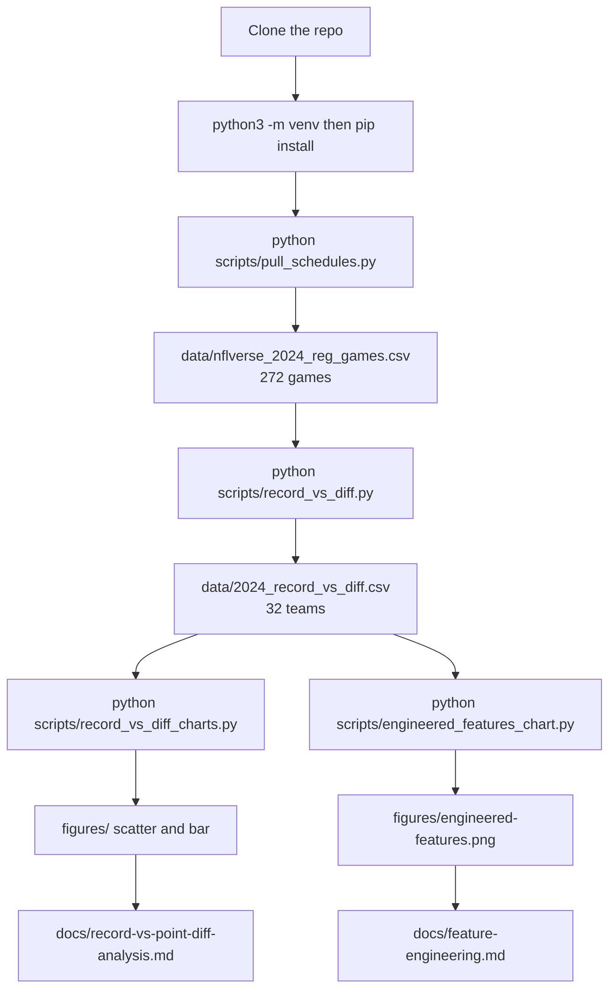
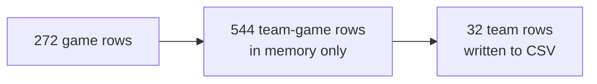
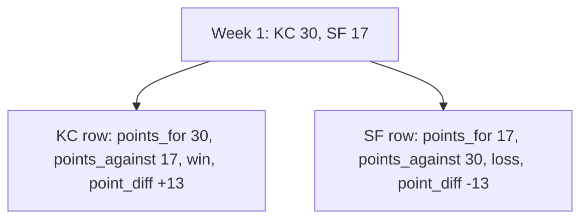
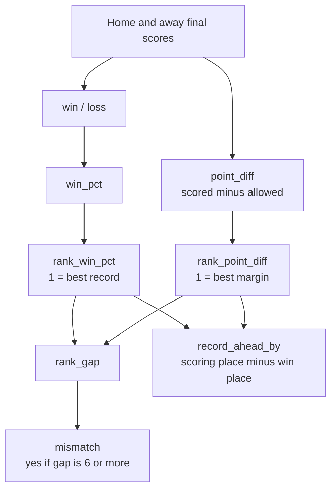
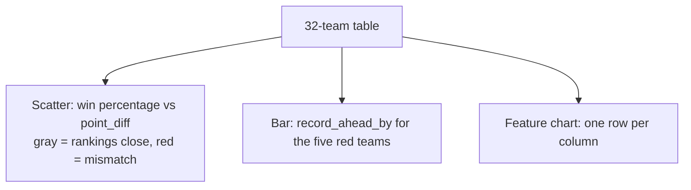
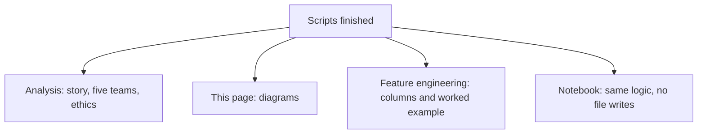

# Analysis pipeline

How to rebuild this 2024 record-vs-scoring ranking from a clone, and how the tables connect. Scripts live in `scripts/`. Findings live on the [analysis](record-vs-point-diff-analysis.md) page. Column meanings live on [feature engineering](feature-engineering.md).

A **record** like **15–2** means 15 wins and 2 losses. **Point differential** is points scored minus points allowed.

## End to end

Clone the repo, install packages, run the four scripts in order, then read the pages.

Source credit for the games file: [source citation](../data/source-citation.md).

## Grain: games to teams

Each extract row is one completed game (home points and visiting points). The ranking script copies that game twice so each team has a row, then adds the season up.

One example game:

## Engineered columns

Season `point_diff` feeds the scoring ranking. Win percentage feeds the win ranking. The gap columns are built from those two places.

Kansas City 2024: `point_diff` +59, win ranking 1st, scoring ranking 11th, `rank_gap` 10, `mismatch` yes, `record_ahead_by` +10.

## How the pictures use those columns

Mean `rank_gap` across 32 teams is **2.9**. Median is **2.5**. The red flag is a gap of **6** or more.

## What to open after the scripts

**Also:** [README](../README.md) · [analysis](record-vs-point-diff-analysis.md) · [feature engineering](feature-engineering.md) · [source citation](../data/source-citation.md)
