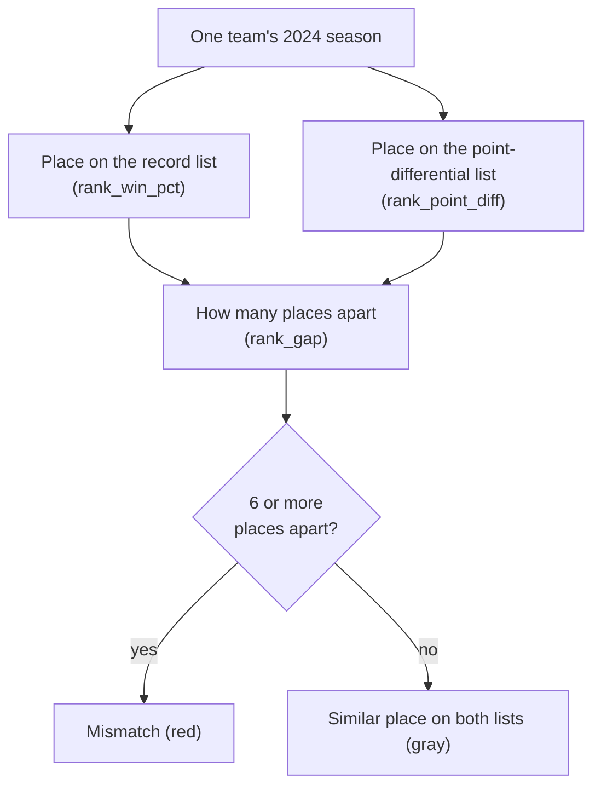

---
hide:
  - toc
---

# Exploratory Data Analysis

This is the **exploratory data analysis (EDA)**: what stood out when the 2024 season was charted and compared.

There are two common ways to sum up a football team's season: its **win–loss record**, and its **point differential** (all the points it scored minus all the points it allowed). For most teams the two match up — teams that win a lot also outscore their opponents. This page looks at the 2024 teams where the two measures give a noticeably different picture, explains what the charts show, and states plainly what these numbers can and cannot tell you.

For how each column is built, see [data preparation and feature engineering](feature-engineering.md). For the steps to run it yourself, see the [reproduction pipeline](reproduction-pipeline.md). The finished table is `data/processed/2024_record_vs_diff.csv`. The [notebook](../notebooks/2024-ranking-walkthrough.ipynb) runs the same steps and saves nothing.

**The main question:** if you rank all 32 teams by record, and separately by point differential, how far does a team move between the two lists?

**The answer:** *5 of 32 teams move at least 6 places.* In all five, the team ranks **higher by record than by point differential** — it won often, but its season point differential was more modest than its record suggests.

The two measures count different things, and that is the whole reason they can rank the same team in very different places:

- **Win–loss record counts only the outcome of each game.** A 1-point win and a 40-point win both count as exactly one win. The winning margin of a game is not part of it.
- **Point differential counts the size of every result** and adds them up over the season, but it counts a point against a weak opponent exactly the same as a point against a strong one.

Both are summaries of the **same 272 games**; they simply keep different details.

## Defining a Mismatch

Rank all 32 teams two ways, with 1st being best:

1. **By record** (`rank_win_pct`) — best win percentage first.
2. **By point differential** (`rank_point_diff`) — best season point differential first.

Tied teams share a place. Kansas City and Detroit both went 15–2, so both are 1st by record; no team is 2nd, and the next teams are 3rd.

A team is a **mismatch** when it sits **at least 6 places apart** on the two lists (about a fifth of a 32-team league). Six is simply the cutoff chosen so that small, one- or two-place differences are not counted. Both lists are valid summaries; the gap just flags where they diverge. This covers the whole regular season: 18 weeks, 17 games per team, taken as one finished period.

Across all 32 teams, the typical move between the two lists is small — **about 3 places** (average 2.9, middle value 2.5). The mismatch cutoff sits at 6. The chart below shows the full spread: most teams sit at a gap of 0–5, and only five reach 6 or more.

## The Five Mismatch Teams (2024)

In all five, the team's place on the record list is higher (a smaller number) than its place on the point-differential list, so `record_ahead_by` is positive.

| Team | Record | Point differential | Record list | Point-diff list | Places higher by record |
| --- | --- | --- | --- | --- | --- |
| **KC** | 15–2 | +59 | 1st | 11th | **10** |
| CAR | 5–12 | −193 | 23rd | 32nd | 9 |
| LA | 10–7 | −19 | 10th | 17th | 7 |
| MIN | 14–3 | +100 | 3rd | 9th | 6 |
| HOU | 10–7 | 0 | 10th | 16th | 6 |

- **Kansas City** finished 15–2 — *the same record as Detroit* — but its point differential of **+59** ranked only 11th. Detroit's 15–2 came with **+222**, best in the league, so Detroit ranks 1st on both lists. Same record, very different point differentials.
- **Houston** went 10–7 while scoring **exactly as many points as it allowed** (point differential of 0).
- **Los Angeles (Rams)** went 10–7 while being **outscored on the season** (−19).
- **Carolina** went 5–12 — already a losing record — with **−193**, the worst point differential in the league.

This pattern is *specific to 2024*: every large mismatch this season had the record ranking higher than the point-differential ranking, which fits a season of close wins paired with lopsided losses. Another season could just as easily run the other way.

## Reading the Charts

All three charts here are drawn by `scripts/record_vs_diff_charts.py`. The notebook draws its own inline versions and saves nothing. The feature chart (`figures/engineered-features.png`) is covered on [data preparation and feature engineering](feature-engineering.md).

### Scatter — Win Percentage vs. Season Point Differential

Each dot is one team's 2024 season, and the shaded background says what winning-and-scoring combination each region represents.

- **Farther right:** higher win percentage.
- **Farther up:** larger season point differential.
- **Dashed line:** the average season point differential at each win percentage across the 32 teams (an ordinary least-squares trend line, not a line where the two are equal). A team above it outscored opponents by more than its record suggests; a team below it by less.
- **Background color:** the quadrant key names each region — for example, the orange band (bottom-right) is *won a lot but with a small or negative point differential*, where most mismatch teams sit.
- **Red dots:** the **five mismatch teams** (6 or more places apart). Each is labeled with its record and where it ranks on each list:
  - KC: 15–2, 1st by record, 11th by point differential
  - MIN: 14–3, 3rd and 9th
  - HOU: 10–7, 10th and 16th
  - LA: 10–7, 10th and 17th
  - CAR: 5–12, 23rd and 32nd

The two crosshair lines mark a **.500 record** (50 across) and an **even point differential** (0 up).

### Dumbbell — Where Each Mismatch Team Sits on the Two Lists

Each row is one of the five red teams. The gray dot is where the team ranks by record, the red dot where it ranks by point differential, and the line between them is the gap. Kansas City: 1st by record, 11th by point differential — a 10-place gap, the widest in the league.

## What These Numbers Can and Cannot Tell You

**Neither number, on its own, measures how good a team truly was.** Each one counts something specific and skips the rest:

- **Record counts only wins and losses.** It does not include the winning margin of any game.
- **Point differential counts the point margin of every game** but does not include *who the opponent was*, *who was injured*, *how close the games were*, or *points scored after the outcome was already decided*.

**Only 17 games.** Each team plays 17 games, which is a small sample. *Two or three close wins* can raise a team's record while barely moving its point differential; *one blowout loss* can drop its point differential while leaving its record unchanged. Kansas City's 15–2 and Houston's even point differential both come from just those 17 games. These numbers describe 2024; they do not predict future seasons.

**No adjustment for opponent.** A +20 result against a weak team counts the same as +20 against a strong one. Point differential does not account for injuries, rest, or whether the usual starter played. Record has the same limitation — a win counts the same regardless of the opponent.

**Late points still count.** After a game is effectively decided, backups often play, and any points scored then still enter the final score, and therefore the season point differential. Those points do **not** mean the losing team nearly won, or that the winner was that much stronger.

**Why the split is worth noticing.** When a team ranks in about the same place on both lists, the second number adds little. When it ranks in very different places, the season reads differently depending on which number you lead with — *that* is the case worth examining, and the reason to report both.

## What Are the Ethical Implications?

The finding is simple: **a single summary number can mislead.** A 15–2 record reads as dominance, yet Kansas City's +59 point differential ranked only 11th — good, not dominant. Leading with just one of these numbers reports only part of what the season showed.

That has real stakes beyond football, because the same habit shows up wherever people rank things by one figure:

- **One metric drives decisions.** Playoff seeding, awards, betting lines, and job security lean on records and rankings. If a single number is treated as the full truth, teams, players, and coaches can be judged unfairly — rewarded for close-win luck or punished for a few lopsided losses.
- **Small samples get over-read.** Seventeen games is not many. Presenting a 17-game number as a settled fact, without noting the uncertainty, overstates how much it proves.
- **Framing is a choice.** The same team can be shown as elite (by record) or ordinary (by point differential). An honest presentation shows both and says what each leaves out; a slanted one picks the flattering number and stops there.

The responsible practice is to **show more than one measure, name what each leaves out, and be honest about the sample size.**

## Takeaways

- Record and point differential are two summaries of the **same 272 games**; each counts a different detail.
- **Neither number, on its own, is how good a team was.** Opponent, injuries, close games, and late scoring are outside both.
- The 2024 mismatch group is *five teams, all ranking higher by record than by point differential.* The sharpest same-record contrast is **KC 15–2 vs DET 15–2**.

**See also:** [data preparation and feature engineering](feature-engineering.md) · [reproduction pipeline](reproduction-pipeline.md) · [conclusions](conclusions.md) · [README](../README.md) · [walkthrough](../notebooks/2024-ranking-walkthrough.ipynb)
