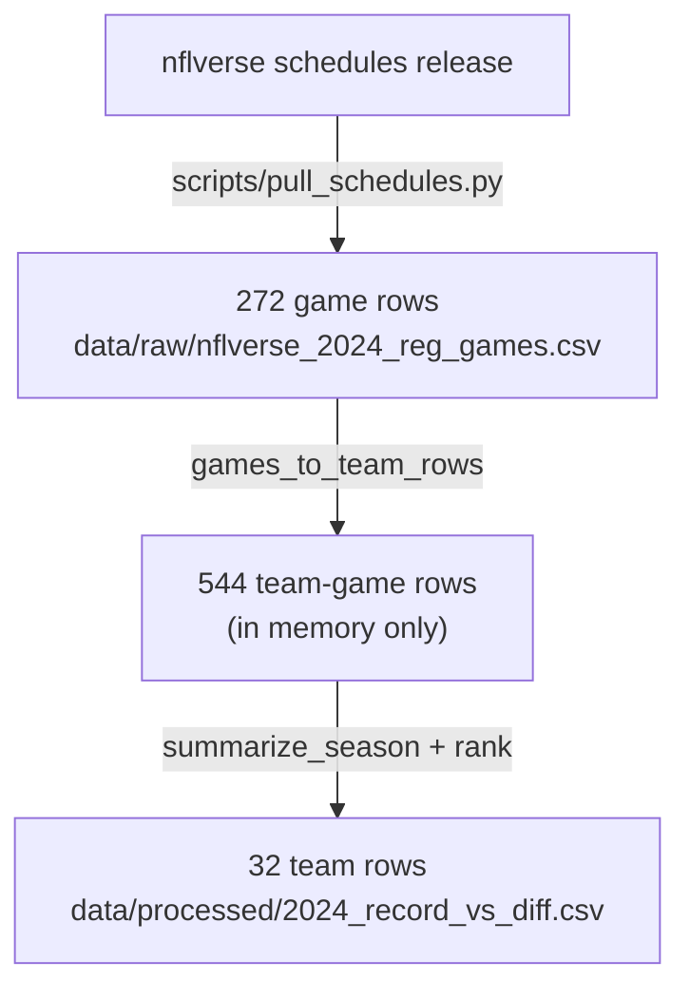

---
hide:
  - toc
---

# Data Preparation and Feature Engineering

This page covers the **preprocessing and feature engineering**: how 2024 regular-season game scores become the per-team table in `data/processed/2024_record_vs_diff.csv`, one row per team. Preprocessing is the cleaning and reshaping that gets the raw scores into a usable form; feature engineering is building the new columns the analysis actually uses (the two rankings, the gap between them, and the mismatch flag). It also gives the columns, how the data changes shape along the way, and how each number is worked out. For what the results mean, see the [exploratory data analysis](exploratory-data-analysis.md). For the commands to run, see the [README](../README.md).

**Where the data comes from:** the nflverse schedules release `games.csv`, filtered to 2024 regular-season games that were actually played, saved as `data/raw/nflverse_2024_reg_games.csv`.
**What uses this table:** the season CSV feeds both chart scripts, `scripts/record_vs_diff_charts.py` and `scripts/engineered_features_chart.py`.

Each starting row is one finished game and its two scores (`home_score`, `away_score`). Anything play-by-play (yards, turnovers, individual stats) is not included. Season `point_diff`, the record ranking (`rank_win_pct`), and the point-differential ranking (`rank_point_diff`) are all just summaries of those same 272 games. Opponent quality, injuries, and rest are not in these columns.

## How the Data Changes Shape



| Shape | Count | Where it lives | What each row is |
| --- | --- | --- | --- |
| Game | 272 | `data/raw/nflverse_2024_reg_games.csv` | One played game |
| Team-game | 544 | In memory only | One team's side of one game |
| Team-season | 32 | `data/processed/2024_record_vs_diff.csv` | One team's whole season |

## Step 1 — Split Each Game Into Two Team Rows

A game row names two teams, so there is no single `team` column to group on yet. The fix: copy each game into two rows, one written from each team's point of view, swapping which score is "for" and which is "against". This turns 272 games into 544 team-games. Worked game — week 1, KC 30, SF 17:

| Field | KC row | SF row | How it's set |
| --- | --- | --- | --- |
| `week` | 1 | 1 | Copied |
| `team` | KC | SF | `home_team` / `away_team` |
| `points_for` (PF) | 30 | 17 | `home_score` / `away_score` |
| `points_against` (PA) | 17 | 30 | The opponent's score |
| `win` | 1 | 0 | 1 if PF is greater than PA |
| `loss` | 0 | 1 | 1 if PF is less than PA |
| `point_diff` | +13 | −13 | PF minus PA (not in the nflverse file) |

There are no ties in this season, so `win + loss` is always 1 for each team-game. Home and away just mark where the game was played.

## Step 2 — Aggregate Each Team's Season

`summarize_season` combines the team-games into one row per team. Every team plays 17 games (18 weeks, one week off), so `games` should be 17 for all 32 teams.

- `games` = how many games the team played
- `wins` / `losses` = the team's total wins / losses
- season `point_diff` = the sum of every per-game point difference
- `win_pct` = `wins / games`

## Step 3 — Engineer the Features: Two Rankings and Their Gap

This step builds the **engineered features** that carry the analysis — the two rankings, the distance between them, and the mismatch flag. Everything before this was cleaning and adding up; these are the new, derived columns that let one team be compared against another.

Rankings use pandas `rank(method="min")`, where `1` is best. Tied teams share a ranking: KC and DET both went 15–2, so both are 1st, and the next team is 3rd. The same rule applies to `point_diff`.

```text
rank_gap          = the distance between the two rankings (always positive)
mismatch          = true when rank_gap is 6 or more   (MISMATCH_RANK_GAP)
record_ahead_by   = rank_point_diff minus rank_win_pct
```

The number 6 is about a fifth of a 32-team league, so small 1–2 place wobble is ignored. When `record_ahead_by` is positive, the record ranking is better (a smaller number) than the point-differential ranking.

### Worked Example — Kansas City vs. Detroit, 2024

- KC 15–2 → record ranking 1 (tied with DET). `point_diff = +59` → point-differential ranking 11. `rank_gap = 10` → `mismatch = true`. `record_ahead_by = 11 − 1 = +10`.
- DET 15–2, `point_diff = +222` → point-differential ranking 1. Both rankings land in the same place → `mismatch = false`.

The code is `build_season_table` in `scripts/record_vs_diff.py`. The [2024 ranking walkthrough](../notebooks/2024-ranking-walkthrough.ipynb) runs the same steps in a notebook and writes no files.

## Column Reference

`data/processed/2024_record_vs_diff.csv`: 32 rows, ranking `1` = best. KC 2024 is the worked example in the feature chart below. The last two fields (`win_percent`, `record`) are built at chart time from the saved columns and are not stored in the CSV.


| Column | Type | How it's built | Empty? | Saved to CSV? | What it means | KC 2024 |
| --- | --- | --- | --- | --- | --- | --- |
| `team` | string | From the game rows | No | Yes | nflverse team code | KC |
| `games` | int | Count of games | No | Yes | Games played | 17 |
| `wins` | int | Sum of wins | No | Yes | Wins | 15 |
| `losses` | int | Sum of losses | No | Yes | Losses | 2 |
| `point_diff` | float | Sum of (PF − PA) | No | Yes | Season point differential | +59 |
| `win_pct` | float | `wins / games` | No | Yes | Win rate between 0 and 1 | 15/17 |
| `rank_win_pct` | int | Rank by `win_pct`, best first | No | Yes | Record ranking | 1st of 32 |
| `rank_point_diff` | int | Rank by `point_diff`, best first | No | Yes | Point-differential ranking | 11th of 32 |
| `rank_gap` | int | Distance between the two rankings | No | Yes | How far apart the rankings are | 10 |
| `mismatch` | bool | `rank_gap ≥ 6` | No | Yes | Flag; threshold is 6 | true |
| `record_ahead_by` | int | `rank_point_diff − rank_win_pct` | No | Yes | Positive means record ranking is ahead | +10 |
| `win_percent` | float | `win_pct × 100` | — | No (chart only) | Scatter x-axis | — |
| `record` | string | `"{wins}–{losses}"` | — | No (chart only) | Record as text | `15–2` |

`win_pct` drives the record ranking. Per-game `point_diff` is built along the way, then added up into the season total shown on the feature chart.

## Deliberate Exclusions

These are limits on what the two rankings can tell you, not a to-do list.

| Left out | Why |
| --- | --- |
| Opponent-adjusted point differential | The data is only schedules and scores, so `point_diff` treats every opponent the same. |
| A mid-season or partial cut | This ranks the finished 17-game season as one whole. |
| A pre-game feature table | This describes the completed season; game-level forecasting features live elsewhere. |
| Rest between games | Rest is in the source data, but this ranking does not use it. |
| Play-by-play, injuries, weather, coaching | Not in the source data. Win rate or point differential alone does not capture team strength. |

**See also:** [reproduction pipeline](reproduction-pipeline.md) · [exploratory data analysis](exploratory-data-analysis.md) · [conclusions](conclusions.md) · [README](../README.md) · [walkthrough](../notebooks/2024-ranking-walkthrough.ipynb)
