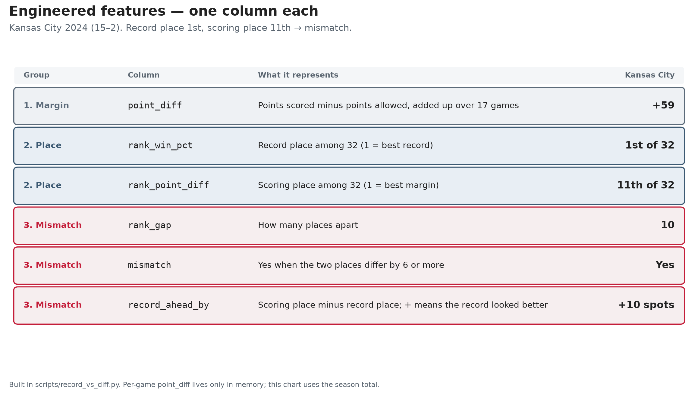

# Feature engineering

This page walks through how **272 completed games** become one row per team, and then the engineered columns the story uses: **scoring margin**, **two rankings**, and the **gap** between those rankings.

Each of those 272 rows is one game’s **final score**: points for the home team and points for the visiting team, on a single line. Sports pages often call that a **box score**. This project does not use the rest of a typical box score (yards, turnovers, individual stats) — only the two point totals.

Scoring margin and the two rankings are compressions of the same season. Team strength is multi-faceted: opponent quality, injuries, and rest sit outside these columns.

Who mismatched, and the charts, live on the [record vs point differential analysis](record-vs-point-diff-analysis.md). The repository homepage is the [README](../README.md).

```text
nflverse schedules Release
        │  scripts/pull_schedules.py
        ▼
272 game rows     data/nflverse_2024_reg_games.csv
        │  scripts/record_vs_diff.py
        ▼
544 team-game rows     (in memory only)
        │  summarize_season() + rankings
        ▼
32 team rows     data/2024_record_vs_diff.csv
        │  scripts/record_vs_diff_charts.py
        │  scripts/engineered_features_chart.py
        ▼
figures/record-vs-diff.png
figures/win-ranking-ahead-of-scoring.png
figures/engineered-features.png
```

```bash
python scripts/pull_schedules.py
python scripts/record_vs_diff.py
python scripts/record_vs_diff_charts.py
python scripts/engineered_features_chart.py
```

## Where the games come from

The source is **nflverse** game schedules. The CSV is **not** a file sitting in a folder on the [nflverse-data](https://github.com/nflverse/nflverse-data) `main` branch — that tree is automation. The table is a **GitHub Release** asset.

| | |
| --- | --- |
| Release | https://github.com/nflverse/nflverse-data/releases/tag/schedules |
| File | https://github.com/nflverse/nflverse-data/releases/download/schedules/games.csv |
| License | [CC-BY-4.0](https://github.com/nflverse/nflverse-data/blob/master/LICENSE.md) |
| Cite | nflverse (Carl, Baldwin, and the nflverse team) |

Do **not** use `nfl.import_schedules()` for this extract. That helper downloads from a different host. This repo reads the Release URL above.

`scripts/pull_schedules.py` downloads the full historical `games.csv`, then keeps one completed regular season: `season == 2024`, `game_type == "REG"` (**regular season**), scores present. You should see **272 games**, weeks **1–18**, and **32** teams. The credit next to the file is [source citation](../data/source-citation.md). Diagrams for the whole run are on the [analysis pipeline](analysis-pipeline.md).

That extract is one row per **game**. It is not a league table of wins and losses.

## Engineered features

Each feature is **one column**. The picture uses Kansas City’s 2024 row (15–2) as the example.



| Group | Column | What it represents | Kansas City |
| --- | --- | --- | --- |
| 1. Margin | `point_diff` | Points scored minus points allowed, added up over 17 games | +59 |
| 2. Rankings | `rank_win_pct` | Place among 32 teams by win–loss record (1 = best) | 1st of 32 |
| 2. Rankings | `rank_point_diff` | Place among 32 teams by scoring margin (1 = best) | 11th of 32 |
| 3. Gap | `rank_gap` | How many spots apart those two places are | 10 |
| 3. Gap | `mismatch` | Yes when the gap is at least 6 spots | Yes |
| 3. Gap | `record_ahead_by` | Scoring place minus win place; + means the win ranking is ahead | +10 spots |

`win_pct` is the share of games won. The win ranking is built from that share. Per-game `point_diff` is built in memory, then summed to the season total on this chart.

## Why each game becomes two rows

The extract names two teams on one line. There is no `team` column, so you cannot `groupby("team")` yet.

One game:

| week | home_team | away_team | home_score | away_score |
| --- | --- | --- | --- | --- |
| 1 | KC | SF | 30 | 17 |

`games_to_team_rows` rewrites that game from each team’s point of view:

| Column | KC row | SF row | Why |
| --- | --- | --- | --- |
| `week` | 1 | 1 | Same game |
| `team` | KC | SF | So later `groupby("team")` works |
| `points_for` | 30 | 17 | Points this team scored |
| `points_against` | 17 | 30 | Points this team allowed |
| `win` | 1 | 0 | 1 if scored more. This 2024 extract has no ties. |
| `loss` | 0 | 1 | 1 if scored less |
| `point_diff` | +13 | −13 | `points_for − points_against` for **this game** |

`point_diff` is the first engineered feature. It is not in the nflverse file. A 30–17 game and a 17–16 game are both wins; only the margin knows the difference. **Home** and **away** only mean which stadium hosted the game, not which half of the league the teams belong to.

| Grain | Rows | Used for |
| --- | --- | --- |
| Game (extract) | 272 | Download only |
| Team-game (in memory) | 544 | Per-game `point_diff`, win, loss. Never written to disk |
| Team (output) | 32 | Season totals, rankings, mismatch |

## Season totals

`summarize_season` adds up every team-game in the regular season. Every team played **17** games in this extract (each team sits out one week — a **bye** — across 18 calendar weeks).

| Column | How it is built | Why |
| --- | --- | --- |
| `games` | Count of rows for that team | Volume |
| `wins` / `losses` | Sum of `win` / `loss` | Season win–loss totals |
| `point_diff` | Sum of per-game `point_diff` | Cumulative scoring margin |
| `win_pct` | `wins / games` | Share of games won |

## Ranking and mismatch

The 32 teams are lined up twice. Ranking **1 = best**. `MISMATCH_RANK_GAP = 6`.

| Column | How it is built | Why |
| --- | --- | --- |
| `rank_win_pct` | Ranking by `win_pct`. Tied teams share a ranking (two 15–2 teams both 1st; the next is 3rd). | Where they sit in the win ranking |
| `rank_point_diff` | Ranking by `point_diff` (largest margin = 1st). Same tie rule. | Where they sit in the scoring ranking |
| `rank_gap` | Absolute difference of those two rankings | Size of the mismatch, ignoring direction |
| `mismatch` | `True` when `rank_gap >= 6` | Large enough to ignore 1–2-spot noise (about a fifth of a 32-team league) |
| `record_ahead_by` | scoring ranking minus win ranking | **Positive** = the win ranking sat *ahead* of the scoring ranking |

Worked example — Kansas City, 2024:

- Record 15–2 → win ranking **1** (tied with Detroit).
- Point differential +59 → scoring ranking **11**.
- `rank_gap` = |1 − 11| = **10** → `mismatch` is true.
- `record_ahead_by` = **+10** (win ranking ten spots ahead of scoring ranking).

Detroit is the contrast: also 15–2, and **+222** (1st in scoring). Those rankings match, so `mismatch` is false.

`build_season_table` in `scripts/record_vs_diff.py` does this. `main` writes the CSV and prints the mismatch list. A contained walkthrough (no script imports) is the [2024 ranking walkthrough](../notebooks/2024-ranking-walkthrough.ipynb).

## Display-only columns (charts, not in the CSV)

`scripts/record_vs_diff_charts.py` adds labels for the pictures. They are not written to `data/2024_record_vs_diff.csv`.

| Column | What | Why |
| --- | --- | --- |
| `win_percent` | `win_pct × 100` | Scatter x-axis as a percent |
| `record` | `"15–2"` | Wins–losses as text, not a decimal |
| `label` | `"KC  15–2"` | Axis labels on the bar chart |

## What this project did not build

The gaps below are not leftover chores. They are why **neither ranking, on its own, suffices**. Strength depends on more than wins and more than margin.

| Left out | Why |
| --- | --- |
| Opponent-adjusted margin | This ranking uses the schedules extract only. Point differential does not know who you played (how strong the opponents were, or per-play efficiency). |
| A mid-season cut, or rest-of-season follow-up | One ranking of the finished 17-game season, not a forecast. |
| A per-game “features known before the game starts” table | Not a model that predicts the next game. |
| Days of rest between games | A schedule claim, not record vs scoring. The extract still contains rest fields; this project does not use them. |
| Play-by-play logs, injuries, weather, coaching | Not in this extract. Team strength is more complicated than the two columns this story compares. |

## Column list (`data/2024_record_vs_diff.csv`)

One row per team (32 rows).

| Column | Feature family | Meaning |
| --- | --- | --- |
| `team` | Identity | nflverse abbreviation (KC, DET, …) |
| `games` | Volume | Regular-season games played (17) |
| `wins` / `losses` | Record | Wins and losses |
| `point_diff` | **1. Margin** | Season total: scored − allowed |
| `win_pct` | Record | `wins / games` |
| `rank_win_pct` | **2. Rankings** | Win ranking (1 = best) |
| `rank_point_diff` | **2. Rankings** | Scoring ranking (1 = best) |
| `rank_gap` | **3. Gap** | How far apart those rankings are |
| `mismatch` | **3. Gap** | Yes if `rank_gap` is at least 6 |
| `record_ahead_by` | **3. Gap** | Scoring ranking − win ranking; positive = win ranking ahead |

**Also:** [analysis](record-vs-point-diff-analysis.md) · [analysis pipeline](analysis-pipeline.md) · [README](../README.md) · [2024 ranking walkthrough](../notebooks/2024-ranking-walkthrough.ipynb)
