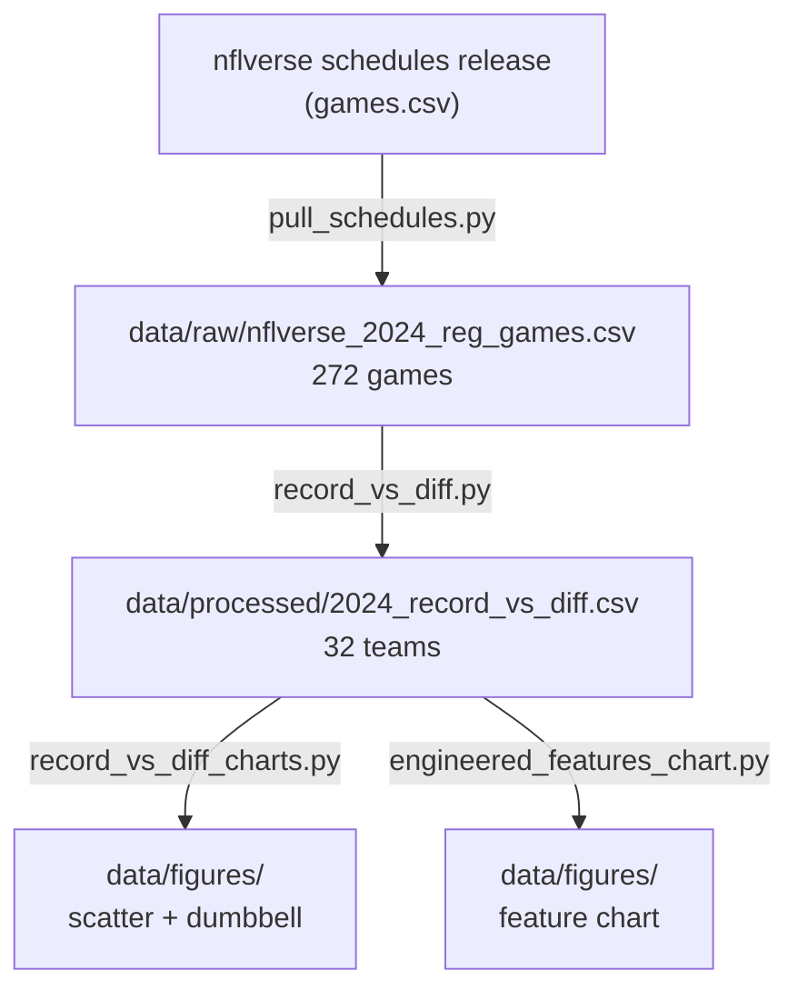

---
hide:
  - toc
---

# Project Overview

There are two common ways to sum up a football team's season: its win–loss record, and its point differential (points scored minus points allowed). This project ranks all 32 teams both ways for the 2024 season and finds the teams that rank in very different places on the two lists — at least 6 places apart. The single takeaway: neither number, on its own, tells you how good a team really was.

This is the documentation site. The repository `README.md` has the commands to run and the list of files; the pages below carry the exploratory data analysis (EDA), the engineered features, and the story the data tells.

## Audience and Motivation

The audience is anyone who reads or repeats NFL standings — fans, writers, and analysts — plus students learning to question a single summary statistic. Records are quoted constantly ("they were 15–2!") as if a record alone settles how good a team was. This project shows, with one full season of data, that **a team can rank near the top by record and only in the middle by point differential** — the two rankings place the same team many spots apart — so a careful reader should look at both. It is a small, honest example of using exploratory data analysis to check a claim people take for granted.

## Dataset and Topic

Every completed 2024 regular-season game and its final score, from the public nflverse schedules data (see the [source citation](../data/source-citation.md)). The topic is narrow on purpose: compare each team's win–loss record with its season point differential, and study where the two diverge.

## How the Data Flows

## Pages, in Reading Order

| Page | What it covers |
| --- | --- |
| [Data preparation & feature engineering](feature-engineering.md) | The steps from games to teams, the column reference, the math |
| [Reproduction pipeline](reproduction-pipeline.md) | Diagrams of the full flow |
| [Exploratory data analysis](exploratory-data-analysis.md) | The five mismatch teams, what the charts show, what the numbers can't tell you |
| [Conclusions](conclusions.md) | The short version and how to use it |

## Key Facts

32 teams; 18 weeks; 17 games per team (one week off); 272 completed regular-season games. Team codes (KC, DET, …) are nflverse abbreviations. A record `15–2` is 15 wins and 2 losses.

Data source and license: [source citation](../data/source-citation.md) (nflverse schedules release, CC-BY-4.0).
