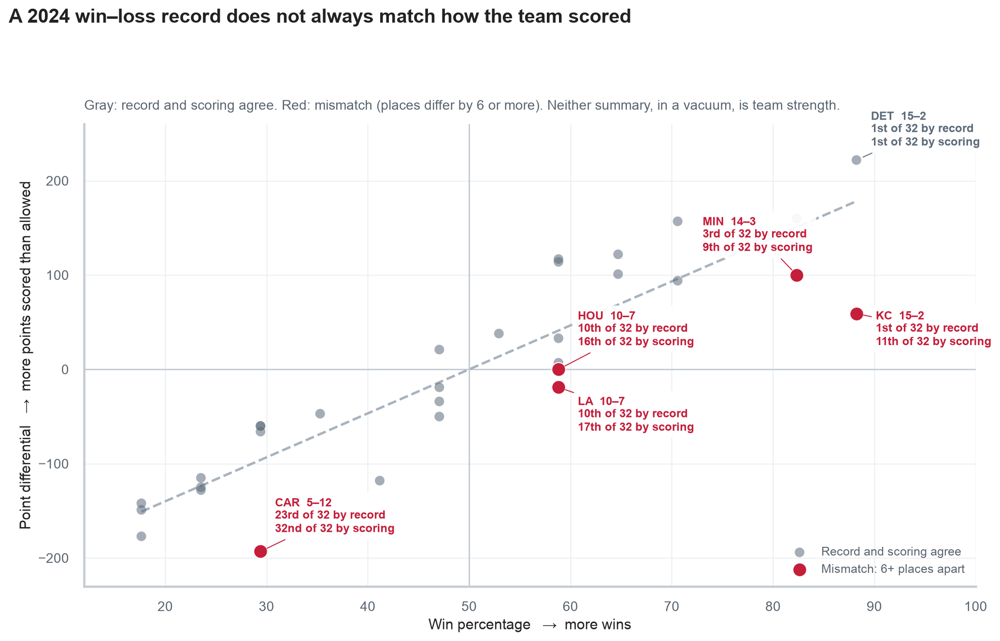
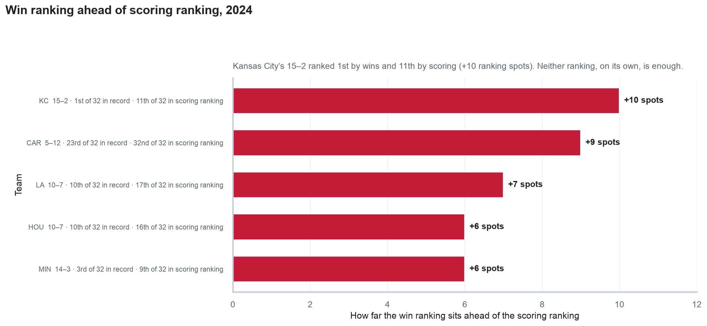

# Record vs point differential analysis

This page is the story of the 2024 NFL regular season (the main 18-week schedule before the playoffs): how **win–loss records** compared with **point differential** (points scored minus points allowed), which teams diverged, what the two pictures show, and where both rankings fall short.

A record like **15–2** means 15 wins and 2 losses. You do not need football play knowledge to follow the rest.

The takeaway is not that one column is “true strength.” Neither ranking, in a vacuum, is enough. Team strength is multi-faceted — more complicated than wins, and more complicated than margin.

If you want the pipeline that produces these numbers, open [feature engineering](feature-engineering.md) or the [analysis pipeline](analysis-pipeline.md) diagrams. The repository homepage is the [README](../README.md). The ranking table lives at `data/2024_record_vs_diff.csv`. A contained walkthrough of the same logic is in [`notebooks/2024-ranking-walkthrough.ipynb`](../notebooks/2024-ranking-walkthrough.ipynb).

## What “mismatch” means

A win does not always mean a strong team, and a loss does not always mean a weak one. The margin of those games can tell a different story than the record. The margin is still only one story. Record throws away how large the win was; point differential keeps the margin but treats every opponent as equal. **Neither summary, on its own, is team strength.**

For the 2024 regular season, every team is lined up **twice**:

1. By **win percentage** (best record = 1st).
2. By **point differential** (most points scored minus allowed = 1st).

Tied teams share a ranking. Kansas City and Detroit were both **15–2** (15 wins, 2 losses), so both are **1st** by wins. Nobody is 2nd; the next teams are **3rd**.

Then compare the two rankings. Kansas City was **1st** by wins and **11th** by scoring — **10 ranking spots** apart. A **mismatch** is when the two rankings are **at least 6 spots** apart (about a fifth of the 32-team league). That is a simple rule for when the two compressions disagree. It is not a claim that one ranking is “true strength.”

The 2024 regular season spanned **18 calendar weeks**, with **17 games per team** (each team sits out one week — a **bye**). This ranking uses every regular-season game. It does not split the year in half, and it does not predict what happens next.

## Teams with a mismatch in 2024

Five teams were at least six ranking spots apart. In every case the **win ranking sat ahead of the scoring ranking**.

| Team | Record (wins–losses) | Point diff | Win ranking | Scoring ranking | Gap |
| --- | --- | --- | --- | --- | --- |
| KC | 15–2 | +59 | 1 | 11 | +10 |
| CAR | 5–12 | −193 | 23 | 32 | +9 |
| LA | 10–7 | −19 | 10 | 17 | +7 |
| MIN | 14–3 | +100 | 3 | 9 | +6 |
| HOU | 10–7 | 0 | 10 | 16 | +6 |

Kansas City finished 15–2 — the same record as Detroit — but only 11th in scoring. Detroit’s 15–2 came with **+222**, first in the league: **1st in both rankings**, so the two summaries agree. Houston went 10–7 while scoring exactly as many points as they allowed. The Rams went 10–7 while getting outscored. Carolina’s 5–12 was already a poor record; their −193 margin was last in the league. In 2024, every large mismatch went the same way: the **win ranking sat ahead of the scoring ranking**. That is a pattern in this season’s close games versus **blowouts** (games decided by a large score), not proof that records always “lie.”

## Charts

`scripts/record_vs_diff_charts.py` writes the PNGs you see on GitHub. The notebook ([`2024-ranking-walkthrough.ipynb`](../notebooks/2024-ranking-walkthrough.ipynb)) draws the same pictures from a contained copy of the logic. You do not need Jupyter to view the images here.

### Scatter — record vs scoring margin

Each dot is one team’s 2024 regular season.

- Teams toward the **right** won a larger share of their games.
- Teams toward the **top** outscored opponents by more.
- The **dashed line** is the usual pairing: better record with better margin.
- **Gray** means **similar rankings**: the win ranking is close to the scoring ranking. Detroit is the named gray example — 15–2 and 1st in both rankings.
- **Red** means **mismatch**: those two rankings are at least 6 spots apart. Each red label shows the record and **both ranks among 32** (win ranking and scoring ranking). Kansas City is 15–2, 1st of 32 in record and 11th of 32 in scoring ranking. Minnesota is 14–3, 3rd and 9th. Houston is 10–7, 10th and 16th. The Rams are 10–7, 10th and 17th. Carolina is 5–12, 23rd and 32nd.

### Bar — how far the win ranking sat ahead

Each bar is one of the five red teams. A longer bar means the win ranking sat further ahead of the scoring ranking. Kansas City’s 15–2 ranked **1st** by wins and **11th** by scoring (**+10 ranking spots**).

## Ethics and limits

**Neither number, in a vacuum, is enough.** A record compresses every game to a win or a loss. Point differential keeps the margin but still collapses a season into one integer. Team strength is multi-faceted and more complicated than either column: who you played, who was hurt, which games were decided by a point or two, and what happened after the winner was already clear.

**17-game sample.** The 2024 regular season has 18 calendar weeks, but each team plays only 17 games (one week off). That is a short season. Two or three wins by a few points can dress up a record; one 40-point loss can wreck a point differential without changing the win column much. Kansas City’s 15–2 and Houston’s 0 point differential both sit on that small pile of games. This ranking is a description of those 17 games, not a claim about a much longer season.

**Schedule strength.** Point differential treats every opponent the same. Beating a 3–14 team 30–10 counts as the same +20 as beating a 14–3 team 30–10. The number does not know who was hurt, who was on a week off the week before, or whether the usual starting passer was out. A “high” or “low” margin can be as much about the list of opponents as about the team. Record has the same hole: a win is a win no matter who it came against.

**Late scores after the game is decided.** Sports coverage often calls this **garbage time**. Once the winner is already clear, teams may put in backups; extra points still count in the final score. That moves point differential — and therefore the mismatch flag — without meaning the closer team “almost won” or the blowout winner “was that much better.”

**What the gap is for.** Gray dots are where the two summaries agree, so the second number adds little. Red dots are where the season looks different depending on which summary you open. The analysis **is** that gap. It is not a search for the one true ranking, and it is not a prediction of the next season.

## Takeaways

- Record and point differential are two compressions of the **same** 272 games, not two independent truths.
- **Neither ranking, in a vacuum, is team strength.** Schedule, injuries, close games, and late scores all sit outside both columns.
- In 2024, five teams had a large split, and in every case the **win ranking sat ahead** of the scoring ranking. Kansas City’s 15–2 versus Detroit’s 15–2 is the clearest pair.

**Also:** [feature engineering](feature-engineering.md) · [analysis pipeline](analysis-pipeline.md) · [README](../README.md) · [2024 ranking walkthrough](../notebooks/2024-ranking-walkthrough.ipynb)
