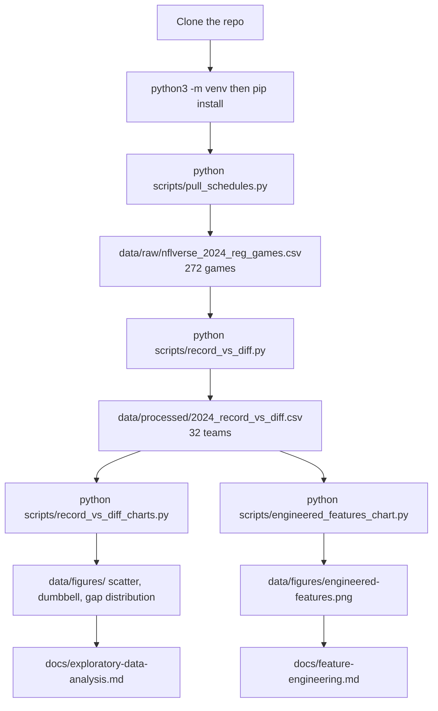
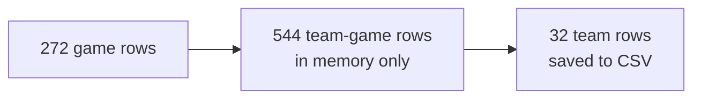
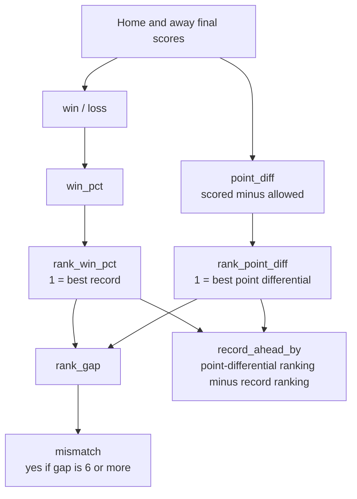
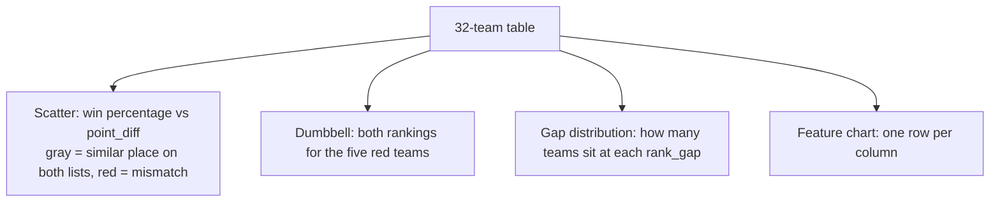

---
hide:
  - toc
---

# Reproduction Pipeline

The full path to reproduce the 2024 record-versus-point-differential project, shown as diagrams. For the column details, see [data preparation and feature engineering](feature-engineering.md). For what the results mean, see the [exploratory data analysis](exploratory-data-analysis.md). For the exact commands, see the [README](../README.md). For the data credit, see the [source citation](../data/source-citation.md).

The path has four scripts: `pull_schedules.py` downloads the games, `record_vs_diff.py` builds the 32-team table, `record_vs_diff_charts.py` draws the three main charts, and `engineered_features_chart.py` draws the feature chart.

## End-to-End Reproduction

Clone the repository, install the packages, run the scripts in order, then read the pages. Two scripts build the data (download, then table) and two draw the charts.

**Run environment:** Python 3.11 or newer (the published-site build uses 3.13). The package versions are pinned in `requirements.txt` — pandas, matplotlib, seaborn, and ipykernel for the notebook. No other system tools are needed; the games file downloads over HTTPS from the nflverse release.

Credit for the games file: [source citation](../data/source-citation.md).

## From Games to Teams, at a Glance

This page shows the flow as diagrams. For how each step works and why — the game-doubling, the tie-sharing rankings, the worked Kansas City example, and the full column reference — see [data preparation and feature engineering](feature-engineering.md); it is not repeated here.

The scores go through three shapes: one row per game, one row per team-game (in memory), one row per team (saved).

From the saved scores, season `point_diff` drives the point-differential ranking and win percentage drives the record ranking; the gap columns come from those two rankings.

## Which Columns Each Chart Uses

Across all 32 teams the average `rank_gap` is **2.9** and the middle value is **2.5**. The mismatch cutoff is a gap of **6** or more.

**See also:** [data preparation and feature engineering](feature-engineering.md) · [exploratory data analysis](exploratory-data-analysis.md) · [conclusions](conclusions.md) · [README](../README.md) · [source citation](../data/source-citation.md)
